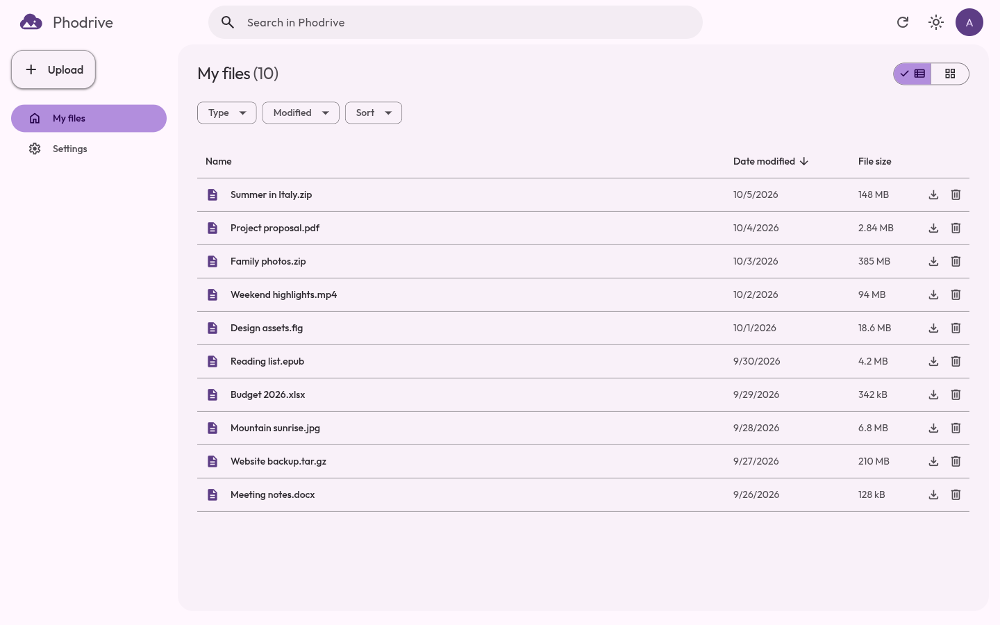
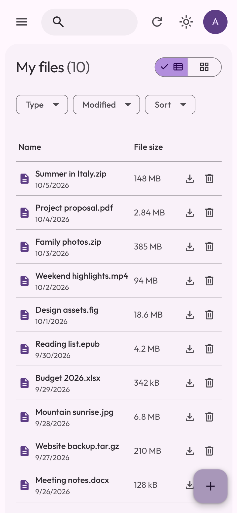
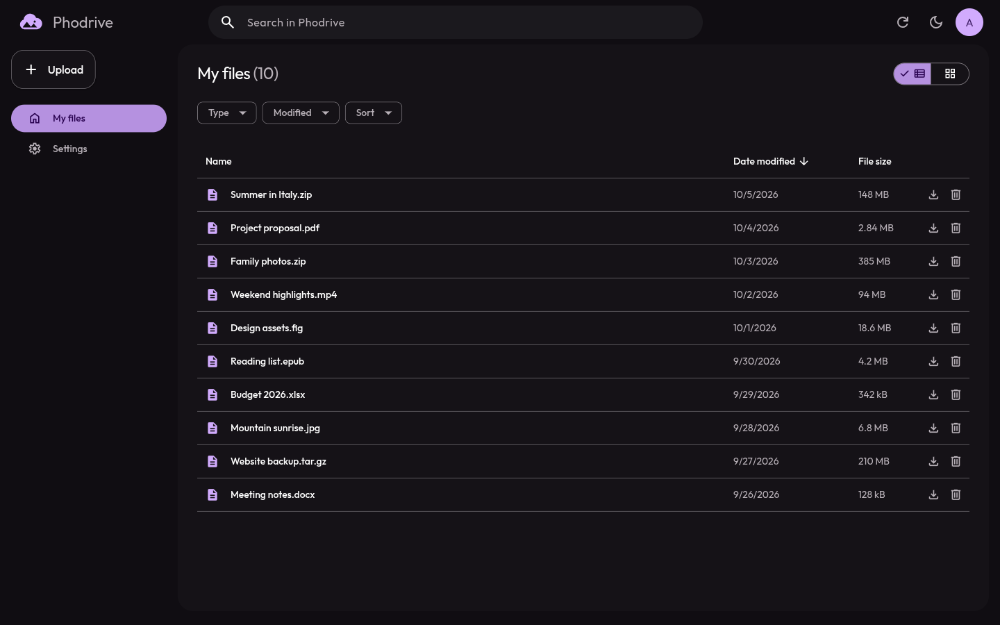
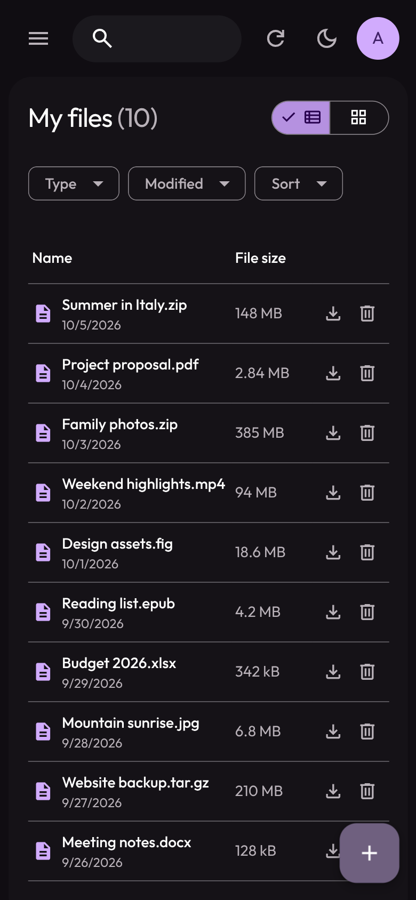
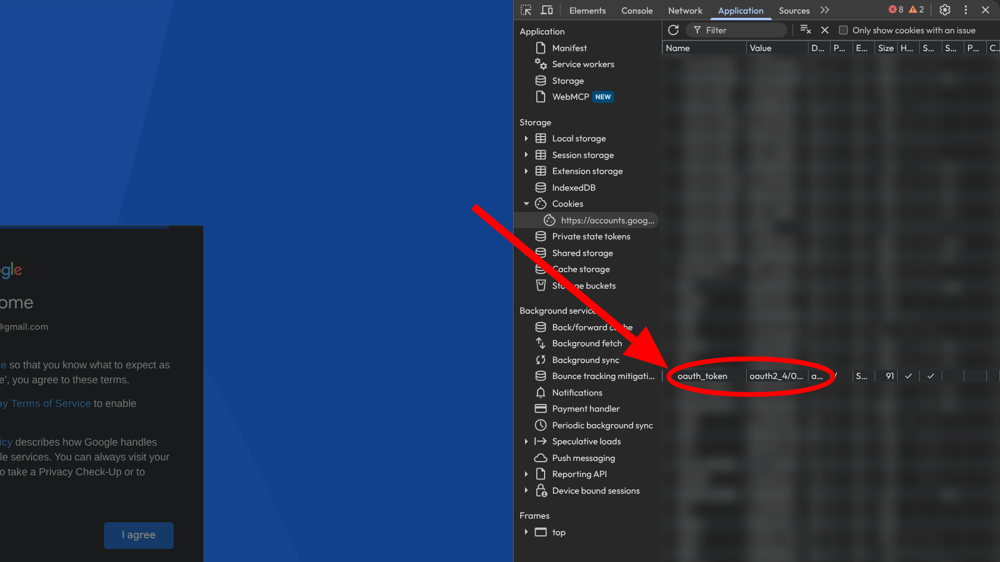

<p align="center">
    
    <h1 align="center">Phodrive</h1>
    <p align="center"><i>Files worth a thousand pixels.</i></p>
</p>

Store files in Google Photos by encoding them as BMP images. Phodrive identifies itself as a Pixel XL to use unlimited photo storage.

> [!CAUTION]
> Using this project may violate Google's terms or policies and could result in your Google account being restricted or banned.

<table>
    <tr>
        <td></td>
        <td></td>
    </tr>
    <tr>
        <td></td>
        <td></td>
    </tr>
</table>

## Run locally

Use Node.js 22.22.2 (22.x) or 24.15 or newer, or Bun.

```sh
bun install
bun --bun run dev
```

1. Open `http://127.0.0.1:5173`.
2. Sign in at [Google Embedded Setup](https://accounts.google.com/EmbeddedSetup).
3. In developer tools, open Application, then Cookies, then `https://accounts.google.com`. Copy the cookie value starting with `oauth2_4/`.
4. Enter your Google account email and paste the token into Phodrive.



> [!NOTE]
> Your browser stores the credentials. The server uses them for each request and does not save them.

### Deployment defaults

Settings use your saved choice first, then the deployment default, then the built-in default. Phodrive saves a browser preference only when you choose a value. Users without a saved choice receive updated deployment defaults.

| Environment variable                        | Built-in default | Allowed values                                           |
| ------------------------------------------- | ---------------- | -------------------------------------------------------- |
| `PHODRIVE_DEFAULT_REFRESH_INTERVAL_SECONDS` | `60`             | Whole seconds from `0` to `86400`; `0` disables refresh  |
| `PHODRIVE_DEFAULT_CONCURRENT_WORKERS`       | `8`              | Whole numbers from `1` to `32`                           |
| `PHODRIVE_DEFAULT_THEME`                    | `auto`           | `auto`, `light`, `dark`                                  |
| `PHODRIVE_DEFAULT_SORT`                     | `modified-desc`  | `modified-desc`, `modified-asc`, `name-asc`, `name-desc` |

Set these variables in the server environment before starting the app. Missing or invalid values use the built-in defaults. The server publishes the validated settings defaults. For example:

```sh
bunx cross-env PHODRIVE_DEFAULT_REFRESH_INTERVAL_SECONDS=120 PHODRIVE_DEFAULT_CONCURRENT_WORKERS=4 bun run dev
```

For Docker, pass the same variables with `-e`, for example `-e PHODRIVE_DEFAULT_CONCURRENT_WORKERS=4`.

To build and run with Node.js:

```sh
bun run build
bun run start
```

To build and serve using Bun:

```sh
bun --bun run build
bun run start:bun
```

Open `http://127.0.0.1:3000` for the production build.

> [!WARNING]
> Do not expose this server to other machines.
>
> The API has no user authentication. Anyone who can reach it can send Google Photos requests through your server and use your machine's network and resources.

## Run with Docker

```sh
docker run --pull always --rm --init --name phodrive -p 127.0.0.1:3000:3000 ghcr.io/madkarmaa/phodrive:latest
```

Open `http://localhost:3000` or `http://127.0.0.1:3000`. The server derives the upload origin from the request host and port, including a different published port. To override it, pass `-e ORIGIN=http://localhost:3000` with the exact origin used in your browser.

## Verify

Tests use [Vitest](https://vitest.dev/).

```sh
bun run check
bun run test
bun run build
```

## Attribution

Copyright © 2026 MadKarma (madkarmaa). Phodrive is licensed under the MIT License; see [LICENSE](./LICENSE).

The Google Photos protocol code is based on [xob0t/gotohp](https://github.com/xob0t/gotohp) (MIT).

The Photos library request mask is based on [xob0t/gpmc](https://github.com/xob0t/gpmc) (MIT).

The OAuth2-to-AAS exchange is adapted from [xhyrom/sniff's `oauth2aas`](https://github.com/xhyrom/sniff/tree/main/oauth2aas) (Apache-2.0).

The OAuth2 exchange's DroidGuard compatibility field follows [simon-weber/gpsoauth](https://github.com/simon-weber/gpsoauth) (MIT).

## AI use

The maintainer uses AI tools for research, code, visual assets, tests, and documentation, and reviews and accepts their contributions.
